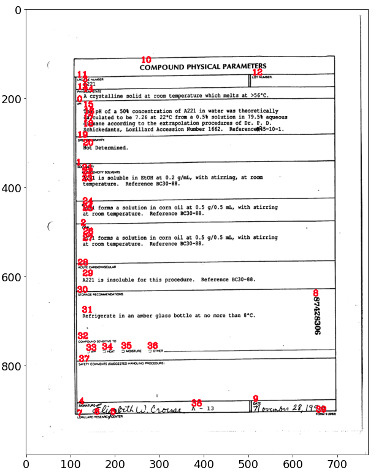
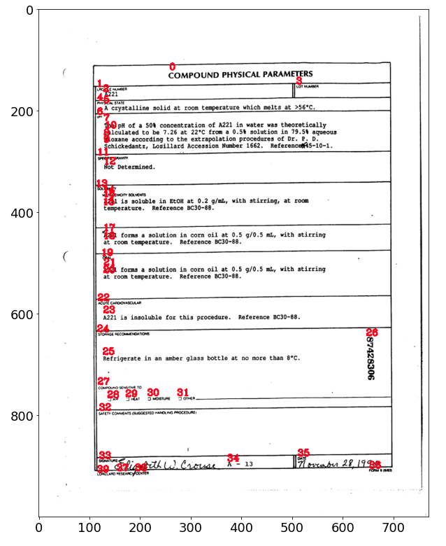

# Augment-XY-Cut

## Introduction

* An unofficial realization for augment-xy-cut algorithm in paper [XYLayoutLM: Towards Layout-Aware Multimodal Networks For Visually-Rich Document Understanding](https://arxiv.org/pdf/2203.06947v2.pdf).

## Visualization

* box order before

    

* box order after xy-cut

    

